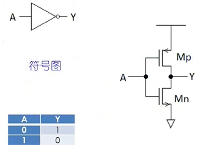
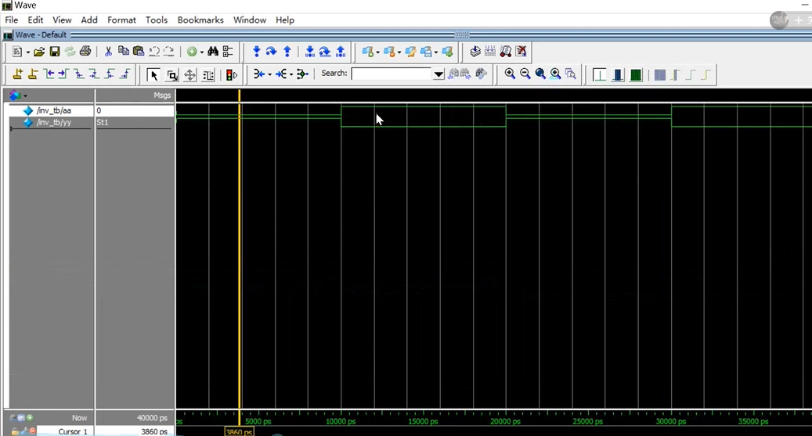
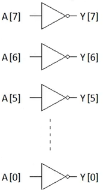
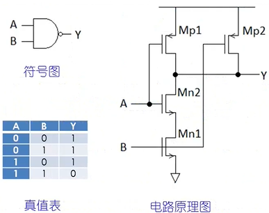
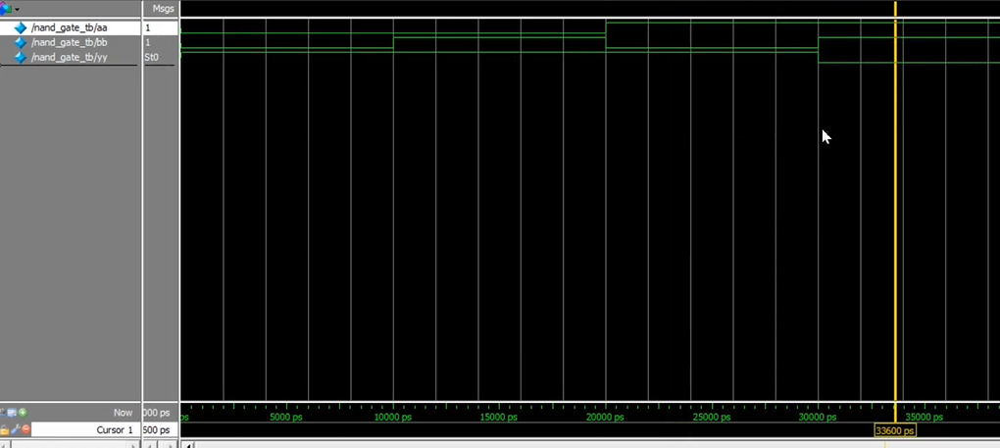
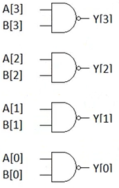
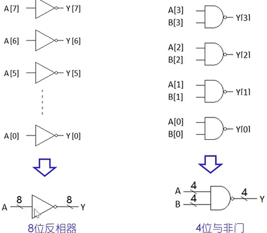

*北京交通大学 金课堂 verilog零基础入门视频*
*https://www.bilibili.com/video/BV1hX4y137Ph?spm_id_from=333.337.search-card.all.click*

# 第一讲 基本逻辑门代码设计与仿真

以前设计电路的流程是：
真值表 -> 卡诺图 -> 面包板 -> PCB
使用Verilog设计的流程：
代码设计 -> 代码仿真 -> FPGA验证 -> ASIC（专用集成电路）实现

## 1.1 基本逻辑门代码设计和仿真

### 1.1.1 反相器
反相器，输入真时输出为假，输入假时输出为真。
```verilog
module inv(A, Y); // module的名称是inv
    input A;      // 声明输入信号
    output Y;     // 声明输出信号
    assign Y = ~A;
endmodule
```
其中`~`为取反运算
符号图、真值表以及电路原理图如下：



verilog的文件以.v命名
写好一个verilog代码要写一个测试，叫做testbench
通过观测被测试的模块输出信号是否符合要求，额可以调试和验证逻辑


```verilog
`timescale 1ns/10ps // 1纳秒的时间单位，10皮秒的精度

// "."表示端口，后面紧跟的比如A表示端口名,表示A端口和Y端口要接收什么
// 小括号内的信号名为与该端口链接的信号线名

// 因为反相器的输入将来要改变，定义成reg类型的变量
// (寄存器的抽象,赋值语句可以改变寄存器的存储值）
// 反相器的输出定义为wire型的变量
// (wire类型用来表示以assign关键字指定的信号,程序中输入输出信号默认为wire型)
reg aa;
wire yy;
module inv_tb(.A(aa), .Y(yy));
    // initial 语句块可以按时间去定义各个语句块的值
    initial begin
        // 下面的#10就是timescale定义的值
                
                // 注意reg类型的变量用 <= 赋值(=赋值也可以，但是有区别，先不管)
                aa <=0; // aa先赋值为0
        #10     aa <=1; // 过10个单位再让aa等于1
        #10     aa <=0; // 再过10，aa变成0
        #10     aa <=1; // 再过10，aa变成1
        #10     $stop;  // 再过10停止（用$表示）
    end
endmodule

```

1、写好代码以后要进行仿真（可以用modelSim软件,类似IDE）
2、可以将verilog代码编译，会将上面写的inv和inv_tb进行编译
3、编译完后可以可以运行，比如运行inv_tb，会显示一个波形观察器
4、将变量（比如aa）从节仿真软件中加入到`wave`的`singals in Region`中
5、执行运行，可以看到波形如下


从图上可以看到10ns为10000ps，两根绿色线靠近表示信号0，两根绿色线远离表示信号1
波形的线是和左侧边栏中变量名对齐的，这样就就能看出哪个变量的波形为1，哪个变量的波形为0

看下面代码:
```verilog
module inv(A, Y); // module的名称是inv
    input[7:0] A;      // 位宽为8，即0到7
    output[7:0] Y;     // 位宽为8
    assign Y = ~A;
endmodule
```
以上表示一个8位反相器，如下图



### 1.1.2 与非门


verilog代码如下：
```verilog
module nand_gate(A, B, Y); // nand有可能是关键字，所以加个_gate
    input A;
    input B;
    output Y;
    assign Y=~(A&B); // 先与后非
endmodule
```

testbench如下：
下面的测试代码使用`异名例化`的方法进行`例化`
所谓`例化`,可以理解成在某个模块中调用另外一个模块,类似c语言中调用一个封装好的函数
只需要调用该函数，而不需要知道函数的实现。

```verilog
module nand_gate_tb; // 类似C语言里的define?(视频里面没说)

`timescale 1ns/10ps

reg aa, bb;
wire yy;
// nand有可能是关键字，所以加个_gate
// 注意下面有两个nand_gate，这个方法就是异名例化
// 第一个nand_gate表示子模块名，第二个nand_gate表示例化模块名
nand_gate nand_gate(.A(aa), .B(bb), .Y(yy)); 
    initial begin
                aa <= 0; bb <= 0;
        #10     aa <= 0; bb <= 1;
        #10     aa <= 1; bb <= 0;
        #10     aa <= 1; bb <= 1;
        #10     $stop;
    end

endmodule
```

进行编译并运行，将aa, bb, yy,添加到wave中，波形如下图：


设计一个4位的与非门如下：
```verilog
`timescale 1ns/10ps
module nand_gate_4bits(A, B, Y);
    input[3:0] A;
    input[3:0] B;
    output[3:0] Y;
    assign Y=~(A&B);
endmodule

module nand_gate_4bits_tb;
reg[3:0] aa, bb;
wire[3:0] yy;

// 注意下面的两个nand_gate
nand_gate_4bits nand_gate_4bits(.A(aa), .B(bb), .Y(yy));
initial begin
            // 下面的4'b0000表示4位的0
            aa <= 4'b0000; bb <= 4'b1111;
    #10     aa <= 4'b0010; bb <= 4'b0110;
    #10     aa <= 4'b0111; bb <= 4'b0100;
    #10     aa <= 4'b0000; bb <= 4'b1110;
    #10     $stop
```

电路图如下：


### 1.1.3 其它门电路
|  逻辑门   | 语句  |
|  ----  | ----  |
| 与门  | Y=A&B |
| 或门  | Y=A|B |
| 或非门  | Y=~(A|B) |
| 异或门  | Y=A^B |
| 同或门  | Y=A^~B |
| 异或非门  | Y=~(A^B) |

前面画好的8位反相器和4位与非门以及其简单画法如下：
